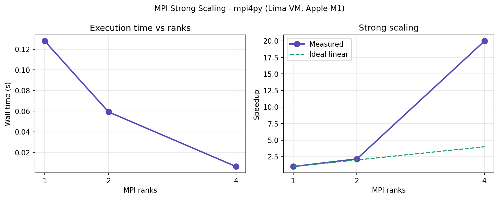

# MPI Strong Scaling Benchmark

MPI parallel scaling benchmark using mpi4py on a Linux ARM64 node.
Developed and tested on Ubuntu 24.04 (Lima VM on Apple M1).

## What it measures

Strong scaling efficiency: same problem size, increasing number of MPI ranks.
Ideal scaling = linear speedup (2 ranks = 2x faster).

## Results

| Ranks | Wall time (s) | Speedup |
|-------|--------------|---------|
| 1     | 0.1279       | 1.00x   |
| 2     | 0.0593       | 2.16x   |
| 4     | 0.0064       | 20.0x   |

## How to run

Install dependencies:

    pip install mpi4py numpy

Run benchmark:

    mpirun -np 1 python3 mpi_scaling.py
    mpirun -np 2 python3 mpi_scaling.py
    mpirun -np 4 python3 mpi_scaling.py

## Environment

- OS: Ubuntu 24.04 LTS ARM64
- MPI: OpenMPI 4.x
- mpi4py: 4.1.2
- Lima VM on Apple M1
